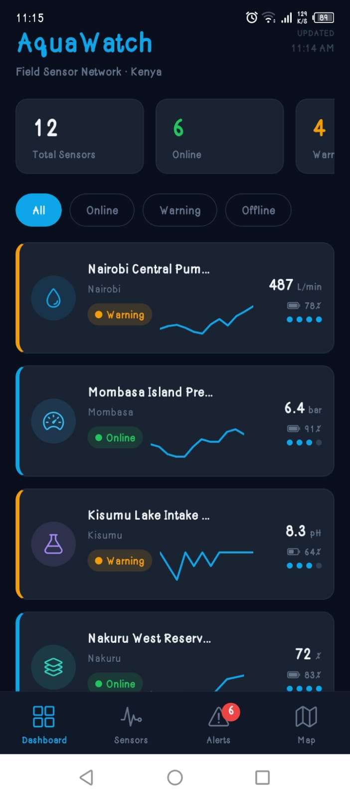
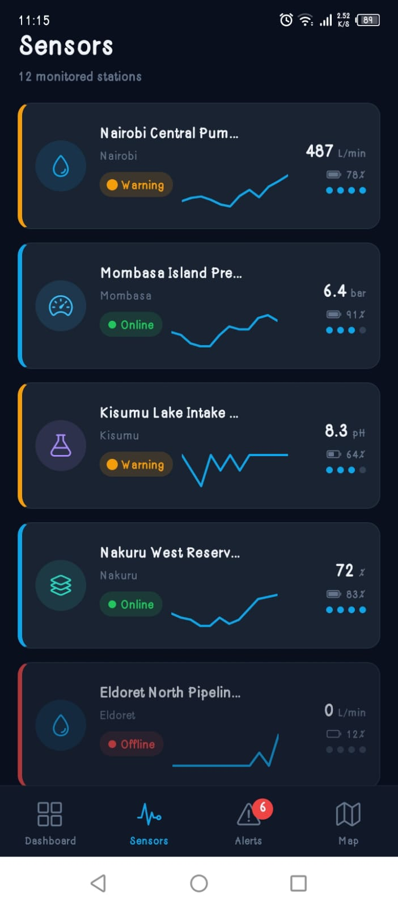
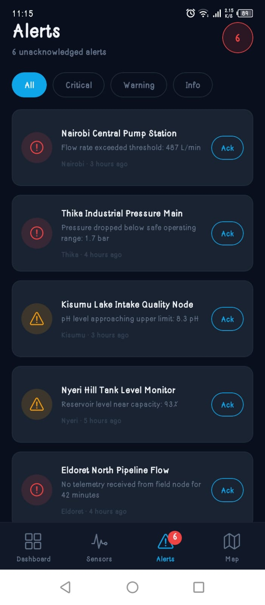
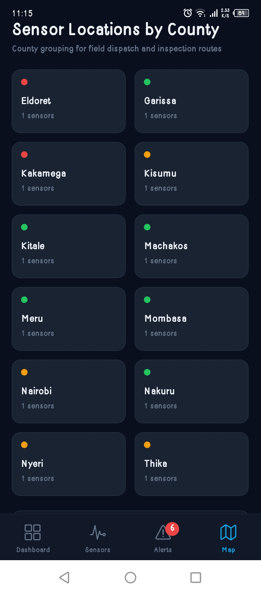

# AquaWatch

> A React Native field sensor dashboard for monitoring water utility 
> infrastructure across Kenya's counties in real time.

Built as a portfolio project demonstrating React Native, Zustand state 
management, real-time data visualisation, and IoT-adjacent mobile 
development patterns.

---

## Screenshots

| Dashboard | Sensor Detail | Alerts | Map View |
|-----------|--------------|--------|----------|
|  |  |  |  |

> Screenshots taken on Expo Go — Android

---

## Overview

AquaWatch simulates a field technician dashboard for a water utility 
network spanning 12 sensor stations across Kenyan counties including 
Nairobi, Mombasa, Kisumu, Nakuru, and more. Field technicians can 
monitor flow rates, pressure levels, water quality pH, and tank levels 
in real time, respond to alerts, and drill into 24-hour sensor history 
charts for individual stations.

This project mirrors the kind of mobile tooling used in IoT-connected 
infrastructure operations water utilities, agribusiness monitoring, 
and manufacturing sensor networks.

---

## Features

- **Live sensor dashboard** — 12 stations across Kenyan counties with 
  real-time status indicators
- **Status filtering** — Filter sensors by All, Online, Warning, or 
  Offline with a single tap
- **Sensor detail view** — Full 24-hour history chart, battery level, 
  signal strength, and AI-generated field insight per sensor
- **Alert management** — Severity-based alerts (Critical, Warning, Info) 
  with one-tap acknowledgement
- **County map view** — Sensors grouped and summarised by county with 
  expandable county cards
- **Pull-to-refresh** — Live data refresh with loading states that 
  mirror real API behaviour
- **Zustand state management** — Centralised, lightweight global state 
  with no boilerplate
- **TypeScript throughout** — Fully typed components, store, and API layer

---

## Tech Stack

| Layer | Technology |
|-------|-----------|
| Framework | React Native (Expo SDK 54) |
| Language | TypeScript |
| State Management | Zustand |
| Navigation | React Navigation v6 (Bottom Tabs) |
| Charts | react-native-chart-kit + react-native-svg |
| Icons | @expo/vector-icons (Ionicons) |
| Mock API | Simulated async fetch with realistic delays |

---

## Project Structure
AquaWatch/
├── App.tsx                  # Entry point — NavigationContainer + SafeAreaProvider
└── src/
├── types.ts                 # Sensor and Alert TypeScript interfaces
├── theme/
│   └── index.ts             # Colors, spacing, border radius tokens
├── api/
│   └── sensors.ts           # Mock data layer with simulated network delays
├── store/
│   └── useSensorStore.ts    # Zustand global store
├── navigation/
│   └── AppNavigator.tsx     # Bottom tab navigator
├── components/
│   ├── SensorCard.tsx       # List item card with status border accent
│   ├── StatusBadge.tsx      # Online / Warning / Offline pill badge
│   ├── AlertItem.tsx        # Alert list item with severity icon
│   └── MiniChart.tsx        # Compact sparkline chart component
└── screens/
├── DashboardScreen.tsx  # Home — summary cards, filter tabs, sensor list
├── SensorDetailScreen.tsx # Full sensor detail with 24hr chart
├── AlertsScreen.tsx     # Alert feed with filter and acknowledgement
└── MapScreen.tsx        # County-grouped sensor location view

---

## Getting Started

### Prerequisites

- Node.js 18 or higher
- npm
- [Expo Go](https://expo.dev/go) on your iOS or Android device (SDK 54)

### Install and run

```bash
git clone https://github.com/TonucciGiovanni/Aquawatch.git
cd Aquawatch
npm install
npx expo start
```

Scan the QR code with Expo Go on your phone.

### Scripts

| Command | Description |
|---------|-------------|
| `npx expo start` | Start the Expo dev server |
| `npm run android` | Run on Android emulator |
| `npm run ios` | Run on iOS simulator |

---

## Architecture Notes

**Mock API pattern** — `src/api/sensors.ts` simulates network requests 
using setTimeout wrapped in Promises. This means all loading states, 
pull-to-refresh behaviour, and error handling work identically to a 
real REST API integration. Swapping in a live endpoint requires only 
changing the fetch functions in this file.

**Zustand store** — All sensor and alert state lives in 
`useSensorStore.ts`. Components call `useSensorStore()` directly — 
no providers, no boilerplate. The store handles loading, refreshing, 
filtering, and alert acknowledgement.

**TypeScript interfaces** — `Sensor` and `Alert` types defined in 
`src/types.ts` are the contract for the entire app. The mock data, 
store state, component props, and screen params all reference these 
types, ensuring consistency across the codebase.

---

## Roadmap

- [ ] Live API integration with real IoT sensor endpoints
- [ ] Push notifications for critical alerts
- [ ] Offline support with AsyncStorage caching
- [ ] Interactive map with MapView and GPS coordinates
- [ ] Export sensor reports as PDF

---

## Author

**Giovanni Tonucci** — Full Stack Developer, Nairobi Kenya

[GitHub](https://github.com/TonucciGiovanni) · 
[LinkedIn](https://www.linkedin.com/in/tonucci-giovanni-94127b300/)

---

## License

MIT
